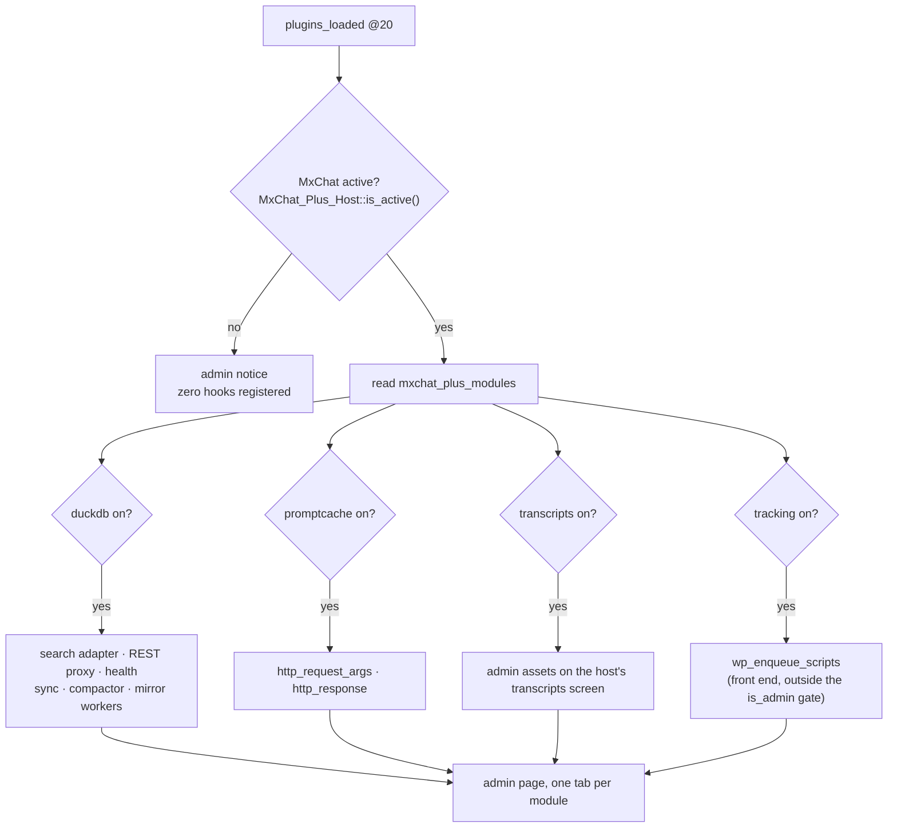
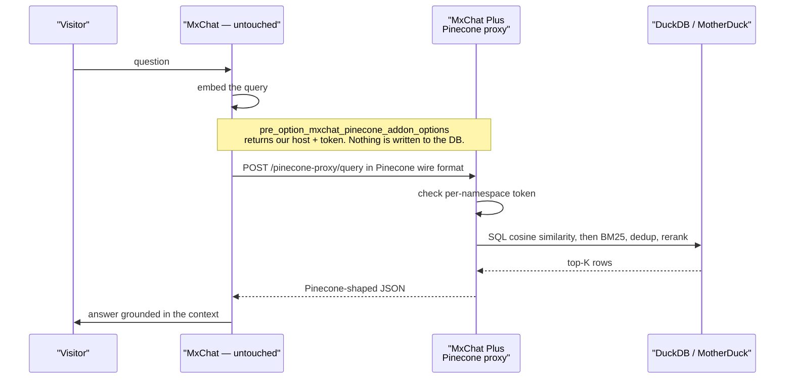
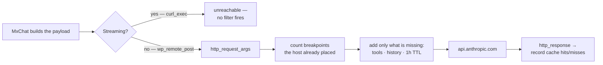

# Architecture

MxChat Plus extends [MxChat](https://mxchat.ai/) (`mxchat-basic`) with four
independent features. MxChat is **third-party software with its own update
stream**, and that single fact shapes every design decision here.

> **The rule this whole plugin is built around:** nothing in this codebase
> modifies MxChat. Not one line. Every feature attaches through WordPress hooks,
> WordPress options, or a REST endpoint the host calls of its own accord.

A patch applied to `mxchat-basic` would be silently overwritten by its next
update, taking the feature with it and leaving no trace of why things broke. So
the interesting part of this architecture is not *what* the modules do — it is
*where they attach*, and which attachment points actually exist.

---

## The four modules

Each is switchable on its own (**MxChat Plus → Modules**). They share no state,
touch no common hook, and can be reasoned about separately. A site that only
wants prompt caching never loads the 26 autoloaded DuckDB classes.

| Module | What it replaces or adds | Attaches through |
|---|---|---|
| `duckdb` | DuckDB / MotherDuck as the vector store, instead of Pinecone | REST endpoint speaking the Pinecone wire protocol |
| `promptcache` | Anthropic prompt caching + cross-provider savings metrics | `http_request_args`, `http_response` |
| `transcripts` | CSV export of selected conversations, or of a date range | `admin_enqueue_scripts` + an AJAX action of our own |
| `tracking` | Matomo / GA4 events for link and suggestion clicks, plus a report over the host's own click table | `wp_enqueue_scripts` + a capture-phase DOM listener |

`tracking` is the only module that **defaults to off**, and the only one that
puts code on a public page. Both follow from the same fact: it is the one feature
that sends data to a third party, which is a decision for the site owner rather
than a default.

---

## Boot sequence



Priority **20** is not arbitrary: MxChat builds its globals on `plugins_loaded`
at the default priority, so the host gate is only meaningful after it has run.

**Class loading.** A static classmap
(`includes/core/class-mxchat-plus-autoloader.php`) maps all 34 classes to their
files. This is deliberate, and it replaced a live fatal: the merged plugin used
a hand-ordered `require_once` list when Composer was absent, and that list
required the MotherDuck connection *before* its parent class — so any install
made by `git clone` (the documented method) died at boot. A classmap makes load
order irrelevant by construction.

`composer.json` declares **no runtime `autoload` section**. Composer is
development tooling here (PHPUnit, PHPStan); `vendor/` is never shipped.

---

## Integration surface: what actually exists in MxChat 3.2.21

This is the expensive knowledge — the part no amount of reading *our* code
gives back. Verified against MxChat 3.2.21 (53 hooks inventoried).

### Vector retrieval

`mxchat_get_bot_pinecone_config` exists, but **it is consulted only for
non-`default` bots, and only when the multi-bot add-on is present**
(`includes/class-mxchat-utils.php:557-566`). For the default bot — i.e. almost
every install — MxChat reads the `mxchat_pinecone_addon_options` option
directly.

**Consequence:** the proxy cannot install itself through that filter. It hooks
`pre_option_mxchat_pinecone_addon_options` instead, so the host reads our host
and token where it expected Pinecone's — and calls our REST endpoint believing
it is calling Pinecone.

Nothing is written to the database. The stored option keeps whatever real
Pinecone credentials the site had, `update_option` still writes through
normally, and turning the module off restores the previous behaviour with no
cleanup. This takeover is **opt-in and off by default**
(`takeover_default_bot_pinecone`): silently redirecting a working Pinecone
install is not a decision a plugin should make on its own.



MxChat never learns it is not talking to Pinecone. No patch, nothing to
re-apply after an update.

A second path exists — a `mxchat_pre_vector_query` filter that would skip the
HTTP round-trip entirely. **That filter does not exist upstream.** Our handler
is registered anyway (it costs one `add_filter` and stays inert), so it would
start working the day MxChat adds it. See
[`docs/duckdb/ARCHITECTURE.md`](docs/duckdb/ARCHITECTURE.md).

### Prompt caching

Two facts govern this module, and both are invisible from our side of the code.

**1. Streaming bypasses the WordPress HTTP API.** MxChat streams through
`curl_exec` (8 call sites in `class-mxchat-integrator.php`), which no WordPress
filter can reach. While streaming is on, prompt caching cannot touch the main
chat — it is not a bug to hunt, it is the architecture. The Modules screen says
so explicitly rather than leaving it to be discovered.

**2. MxChat already caches its own system prompt.** Since 3.2.21,
`mxchat_anthropic_system_blocks()` marks the system block with
`cache_control: ephemeral`. Anthropic allows **at most four breakpoints per
request** and rejects the request beyond that — so this module counts the
host's existing breakpoints against the budget before adding any of its own,
and never duplicates one.



What the module adds on top of the host: breakpoints on **tool definitions**
and on **conversation history** (the growing part, and the real win on long
chats), the **1-hour TTL**, per-model minimum thresholds, and persisted
cross-provider metrics.

### Transcripts export

MxChat ships `wp_ajax_mxchat_export_transcripts`, but it dumps the **entire
table** and ignores the checkboxes. Exporting a selection needed its own path.

Its toolbar offers no action or filter hook, so the button is injected
client-side; and the host keeps its `selectedSessions` Set inside its own
closure, so the selection is read back from the DOM instead. Both are
concessions to the no-modification rule — documented here so they read as
deliberate rather than sloppy.

### Click tracking

MxChat 3.2.21 **does** log link clicks server-side. `attachLinkTracking()`
(`js/chat-script.js:2174-2227`) POSTs `mxchat_track_url_click`, and
`MxChat_Integrator::mxchat_track_url_click()`
(`includes/class-mxchat-integrator.php:14752-14793`) inserts into
`{prefix}mxchat_url_clicks`. So the module is deliberately *not* a
reimplementation of that: its admin half reads that table and reports on it,
because the host only ever shows a `DISTINCT clicked_url` list per conversation
and exposes nothing in its CSV or REST output.

The browser half exists for what the table structurally cannot hold: what the
visitor does *after* following the link. Three host facts shape it, and each is
load-bearing:

- **The listener must be in the capture phase.** The host binds its own handler
  directly on each `<a>` and calls `stopPropagation()`
  (`js/chat-script.js:2193-2195`). A bubble-phase listener on `document` never
  sees a link click at all. Capture runs on the way down and always fires.
- **The handler must never call `preventDefault()`.** The host cancels the event
  itself and navigates programmatically from its own AJAX completion callback
  (`:2205-2219`). Cancelling the links it does *not* bind — every relative one —
  would strand the visitor on the page with no error anywhere.
- **Bot id and session id come from the host's own globals.**
  `window.getBotIdFromElement` and `window.getChatSession` are exported at
  `js/chat-script.js:4426-4432` "for add-ons". Re-deriving them from the DOM is
  what the standalone predecessor did, and it got both wrong: the suggestion
  buttons live in `#mxchat-popular-questions-{botId}`, a **sibling** of
  `#chat-box-{botId}` (`includes/class-mxchat-public.php:366-370`), so a
  chat-box walk resolves nothing for them; and a hand-rolled cookie read misses
  the in-memory session the host keeps when cookies and localStorage are both
  blocked.

The dependency array of the enqueue is empty **on purpose**: under MxChat's
`delay` and `interaction` loading strategies the host never registers its
`mxchat-chat-js` handle, and WordPress silently drops any script whose
dependency is missing.

---

## Repository layout

```
mxchat-plus.php              bootstrap: constants, autoloader, host gate, modules
uninstall.php                single entry point (WordPress runs only one)
includes/
  core/                      gate, module registry, autoloader, tabbed admin page
  duckdb/                    vector store — see docs/duckdb/ARCHITECTURE.md
  promptcache/               cache_control injection, metrics, CLI, dashboard
  transcripts/               CSV export of the host's selected conversations
  tracking/                  Matomo/GA4 click events + report over mxchat_url_clicks
admin/views/duckdb/          settings view + section partials
admin/views/tracking/        settings view (form + clicked-links report)
assets/js/                   admin scripts, plus tracking.js (the only front-end one)
languages/                   .pot, .po and the compiled .mo (shipped)
tests/unit/{duckdb,promptcache,transcripts,tracking}/   one suite per module
tools/patches/               optional upstream patch — excluded from the release zip
```

---

## Conventions that are load-bearing

Not style preferences — each one silently breaks something when violated.

- **Host symbols are untouchable.** Literals like `mxchat_options`,
  `mxchat_pinecone_*`, `mxchat_system_prompt_content`, `mxchat_chat_transcripts`
  and `wp_ajax_mxchat_bulk_delete_knowledge` belong to MxChat. Our own symbols
  all carry a `mxchat_plus_` / `MxChat_Plus_` / `MXCHAT_PLUS_` prefix, which is
  what makes the two sets safely separable.
- **`includes/duckdb/class-duckdb-*.php` basenames are matched by
  `phpstan/UnsafeSqlConstructionRule.php`**, the project's only guard against
  SQL built by concatenation. Renaming those files disables it silently.
- **Test shims load before the autoloader** (`tests/bootstrap.php`). Their
  `class_exists()` guards would otherwise pull in the real class and the test
  doubles would never take effect.
- **The prompt-cache model table is order-sensitive.**
  `min_chars_for_model()` tests `mythos-preview` before `mythos`, `haiku-4`
  before `haiku`. Reordering the clauses is a real regression — it already
  happened once, and is now locked by a test.
- **Run PHPStan through `composer stan`**, which passes `--memory-limit=512M`.
  Invoking `vendor/bin/phpstan` bare crashes on PHP's 128M default, and a
  crashed run reports "no errors" just like a clean one.

See [`CONTRIBUTING.md`](CONTRIBUTING.md) for the commands, and
[`docs/`](docs/) for per-module guides.
