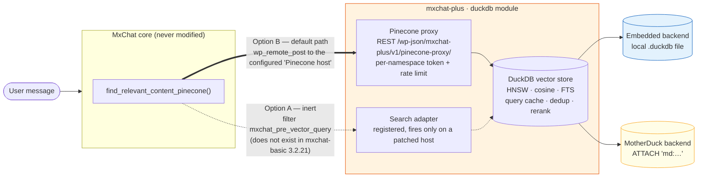
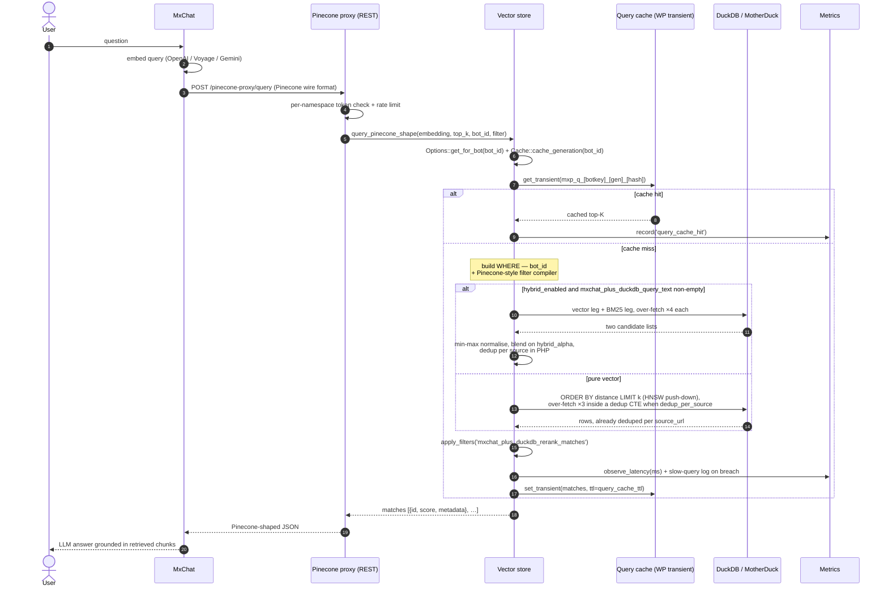

# Architecture — DuckDB vector store

How the **`duckdb` module** plugs into MxChat, how a query flows through it, and where each
class lives.

This document covers the vector-storage subsystem only. For the plugin as a whole — the three
modules (`duckdb`, `promptcache`, `transcripts`), the boot sequence, the autoloader and the
repository layout — see [`../../ARCHITECTURE.md`](../../ARCHITECTURE.md).

---

## How it plugs into MxChat

`mxchat-basic` is third-party software with its own update stream, so the module attaches
through hooks, options and a REST endpoint the host calls of its own accord — **nothing in
this codebase modifies MxChat**.

There are two possible attachment points on the retrieval path. Only one of them exists
upstream today, and that is the one the module actually runs on.



### Option B — Pinecone wire-protocol proxy (the default, and the only path that runs on a stock host)

The module tells MxChat that its Pinecone backend is this very site, then serves a REST
namespace at `/wp-json/mxchat-plus/v1/pinecone-proxy/` that emulates the Pinecone wire
protocol (`/query`, `/vectors/fetch`, `/vectors/upsert`, `/vectors/delete`, `/vectors/list`).
MxChat performs its usual `wp_remote_post()`; the proxy authenticates the per-namespace token,
rate-limits the caller and translates each call into DuckDB SQL. MxChat never learns it is not
talking to Pinecone, and there is nothing to re-apply after a host update.

Registering itself as the backend takes two hooks, because MxChat resolves the Pinecone config
two different ways (`MxChat_Plus_DuckDB_Search_Adapter::register_hooks()`):

- `mxchat_get_bot_pinecone_config` — consulted only for **non-`default`** bots, and only when
  the multi-bot add-on is loaded (`mxchat-basic/includes/class-mxchat-utils.php:557-566`).
- `pre_option_mxchat_pinecone_addon_options` — for the **default bot**, which is almost every
  install, MxChat reads that option straight from `wp_options`. The WP-core `pre_option_*`
  filter intercepts the read without persisting anything; the DB row is never touched. This is
  opt-in through the `takeover_default_bot_pinecone` setting (**off by default**) so sites
  pointing at a real Pinecone index are not hijacked by installing the plugin.

Operationally the proxy has three prerequisites — working HTTPS loopback, pretty permalinks,
and a reachable `/wp-json/` — documented in the [README](../../README.md).

### Option A — `mxchat_pre_vector_query` filter (optional, inert by default)

A short-circuit filter on `find_relevant_content_pinecone()` would let the module return
matches before MxChat makes any HTTP call, saving the round-trip and the JSON serialization of
the embedding vector.

**That filter does not exist in `mxchat-basic` 3.2.21** — verified against all 53 hooks the
host exposes. `MxChat_Plus_DuckDB_Search_Adapter::pre_vector_query()` is registered anyway: an
`add_filter` that never fires costs nothing, and the path would light up by itself the day
MxChat ships the hook. The legacy `mxchat_pinecone_matches_override` contract stays registered
for the same reason.

Activating Option A today means applying
[`tools/patches/mxchat-pre-vector-query.diff`](../../tools/patches/README.md) to `mxchat-basic`
yourself. That is **discouraged**: it modifies a third-party plugin that auto-updates, so the
next MxChat release silently reverts the patch and takes retrieval performance — not
correctness, since Option B resumes — with it, leaving no trace of why. The patch is written
as a proposal to send upstream, not as an install step. `tools/` is excluded from the release
zip by the allow-list in `.github/workflows/release.yml`, so it ships to nobody.

Both paths return identical results.

---

## Query lifecycle

What actually happens when the chatbot answers a question, on the default (Option B) path.
Numbered arrows show the order.



**Cache invalidation**: any `upsert()` or `delete_*()` call invalidates the query cache via
`MxChat_Plus_DuckDB_Cache::flush_query_cache($bot_id)`, which bumps a **per-bot** generation
counter woven into the transient key (`mxp_q_<botkey>_<gen>_<hash>`). A write to one bot
leaves other bots' cached top-Ks intact. So a stale top-K can survive at most
`query_cache_ttl` seconds, or until the next write **to that bot**, whichever comes first. The
daily compactor sweeps each bot's superseded generations; orphans also lapse via TTL.

**Per-bot config**: `run()` resolves its retrieval settings via
`MxChat_Plus_DuckDB_Options::get_for_bot($bot_id)` — the global config with any per-bot
overrides applied (hybrid, dedup, query cache, slow-query threshold), then passed through the
`mxchat_plus_duckdb_bot_config` filter. Storage-level settings (backend, table, dimension,
metric, HNSW, layout) stay global — every bot shares one physical store.

**Hybrid retrieval**: when `hybrid_enabled = true` *and* the `mxchat_plus_duckdb_query_text`
filter returns a non-empty string, the store runs two over-fetched queries (vector + BM25),
min-max-normalises both score lists, blends them with `hybrid_alpha`, and reranks. Falls back
to pure vector when DuckDB FTS isn't available.

**Slow-query log**: every `observe_latency()` checks the result against `slow_query_ms` and
writes a one-liner to PHP's error log on breach, with bot id and feature flags inlined.

---

## Compaction lifecycle

`MxChat_Plus_DuckDB_Compactor` runs nightly (03:00 UTC plus a deterministic per-install jitter,
so many installs don't hit MotherDuck on the same minute). It does two independent things.

**1. Stale query-cache sweep.** Bumping a generation counter makes the previous generation's
transients unreachable but does not delete them, so on a write-heavy install they pile up in
`wp_options` faster than WordPress' own expired-transient GC reclaims them. The sweep deletes
every generation of a bot's keys except the current one. It runs *before* the freshness guard
below — a site that syncs constantly is exactly the site that accumulates these fastest, and
gating the sweep behind the guard meant it never ran there.

**2. Orphan-vector prune.** A vector is an orphan when its `vector_id` no longer corresponds to
any row of MxChat's MySQL knowledge base. The job builds the set of live ids by paging the KB,
then pages the DuckDB table and deletes what isn't in that set. It skips entirely if a sync ran
in the last hour, and is capped per run by `mxchat_plus_duckdb_compactor_max_deletes`
(default 5000).

Two properties of that prune are load-bearing:

- **It pages by keyset cursor on `vector_id`, never by `LIMIT`/`OFFSET`.** The scan deletes
  from the very table it is walking, so with an offset every purge shifted the remaining rows
  left while the offset kept advancing by a full page — up to 1000 vectors skipped after each
  batch, and a sweep that could never fully compact. A cursor resumes from the last
  `vector_id` actually seen and is immune to rows vanishing behind it.
- **It disables itself after a Pinecone import.** The migrator preserves Pinecone's own vector
  ids, which need not follow the `md5(url)[_chunk_N]` convention the sync writes — so those
  vectors look like orphans and would be deleted the very night after a migration whose whole
  point was to avoid re-embedding them. `orphan_pruning_allowed()` returns `false` while the
  migrator's marker option reports copied vectors. Sites that know their imported ids do match
  can re-enable pruning with the `mxchat_plus_duckdb_compactor_prune_orphans` filter, documented
  in [HOOKS.md](HOOKS.md#mxchat_plus_duckdb_compactor_prune_orphans).

The alive-id set must be derived with exactly the same chunk logic as the write path
(`MxChat_Plus_DuckDB_Mysql_Sync::parse_chunk_prefix` + `vector_id_for_row`); if the two drift,
no chunked row ever matches and the job deletes the entire chunked KB, `max_deletes` rows a
night, silently.

---

## File layout — the `duckdb` module

Only this module's files. The plugin-wide tree is in
[`../../ARCHITECTURE.md`](../../ARCHITECTURE.md#repository-layout).

```
includes/duckdb/
├── class-duckdb-options.php                    Settings, defaults, per-bot overrides, sanitizer
├── class-duckdb-cache.php                      Per-bot query-cache generation counters
├── class-duckdb-metrics.php                    Rolling latency window + counters
├── class-duckdb-quantization.php               INT8 round-trip helpers
├── class-duckdb-connection.php                 Connection interface + cached factory
├── class-duckdb-embedded-connection.php        PECL + CLI backend, init SQL, retry
├── class-duckdb-motherduck-connection.php      ATTACH 'md:…' over the embedded backend
├── class-duckdb-mirrored-connection.php        MotherDuck primary + local DuckDB shadow
├── class-duckdb-mirror-bootstrap.php           Fills the local shadow from MotherDuck
├── class-duckdb-mirror-drain.php               Replays the mirror_pending write queue
├── class-duckdb-mirror-drift-check.php         Daily primary/local divergence check
├── class-duckdb-vector-store.php               Orchestrator: write path, Parquet I/O, lifecycle
├── class-duckdb-vector-store-schema.php        Migration runner + meta table (target v3)
├── class-duckdb-vector-store-query.php         Read path: top-K, hybrid, dedup, cache, slow log
├── trait-duckdb-sql-helpers.php                Shared SQL primitives (quoting, score expression)
├── class-duckdb-sync.php                       Façade over the two ingestion pipelines + cron
├── class-duckdb-mysql-sync.php                 MySQL KB → DuckDB (bulk, incremental, cascade)
├── class-duckdb-post-reprocessor.php           WP posts → DuckDB via mxchat's own pipeline
├── class-duckdb-async-reprocess.php            Action Scheduler driver
├── class-duckdb-pinecone-migrator.php          Resumable Pinecone → DuckDB copier
├── class-duckdb-compactor.php                  Nightly orphan prune + stale-cache sweep
├── class-duckdb-pinecone-proxy.php             REST endpoints (Option B), token + rate limit
├── class-duckdb-search-adapter.php             Host filters: Option B config, inert Option A
├── class-duckdb-health.php                     GET /wp-json/mxchat-plus/v1/health
├── class-duckdb-admin.php                      Settings page + AJAX handlers
├── class-duckdb-cli.php                        WP-CLI commands (loaded only under WP_CLI)
└── uninstall-duckdb.php                        Module cleanup, called from uninstall.php

admin/views/duckdb/
├── settings.php                                Settings view
└── partials/                                   8 sections: activation, embedded, motherduck,
                                                vector-schema, performance, retrieval-quality,
                                                bot-overrides, diagnostics

tests/unit/duckdb/                              30 PHPUnit suites (pure-PHP units + shimmed WP)

docs/duckdb/
├── ARCHITECTURE.md                             (this file)
├── CONFIGURATION.md                            Every option, sidecar storage, change guards
├── HOOKS.md                                    Every filter / action, with PHP examples
├── CLI.md                                      Full WP-CLI reference
├── USAGE.md                                    Howtos: async, Pinecone, Parquet, INT8, health
├── MIRROR.md                                   Operating the MotherDuck + local mirror
├── DESIGN-motherduck-mirror.md                 Why the mirror is built the way it is
└── BACKUP.md                                   Backup / restore procedures
```

Two paths outside the module matter to it:

- `tools/patches/` — the optional, currently inapplicable upstream patch (Option A). Excluded
  from the release zip.
- `phpstan/UnsafeSqlConstructionRule.php` — the project's guard against SQL built by
  concatenation. It matches on the `includes/duckdb/class-duckdb-*.php` basenames, so renaming
  those files disables it silently.

## Design conventions

- **Single connection per request.** `MxChat_Plus_DuckDB_Connection_Factory::current()` is the
  only sanctioned way to obtain a backend handle; it caches one instance per request, keyed by
  mode + token fingerprint. Construct one by hand and you silently bypass the cache.
- **Schema changes are migrations.** Bump
  `MxChat_Plus_DuckDB_Vector_Store_Schema::TARGET_SCHEMA_VERSION` (currently 3) and add an
  `apply_migration()` branch. Migrations must be idempotent — they may run against an install
  that already has part of the target state.
- **Writes invalidate the cache.** `upsert()` and `delete_*()` flush the query cache themselves
  via `MxChat_Plus_DuckDB_Cache::flush_query_cache($bot_id)` (per-bot; pass no argument only for
  a genuine flush-all such as a full resync or Parquet import). Any new write path must do the
  same.
- **No HTTP for MotherDuck.** MotherDuck has no public SQL-execution REST API; all traffic goes
  through DuckDB's native protocol via `ATTACH 'md:…'`.
- **Errors are surfaced, not swallowed.** Use `error_log()` + the `last_error` option + the
  admin-notice transient instead of returning empty matches silently — except where graceful
  degradation is explicitly documented (FTS missing, HNSW unavailable).
- **No runtime Composer dependency.** `composer.json` deliberately declares no `autoload`
  section; classes load through `includes/core/class-mxchat-plus-autoloader.php`, a static
  classmap. The plugin must keep booting on installs where `composer install` was never run
  (`vendor/` is never shipped). Composer is development tooling only — PHPUnit and **PHPStan at
  level 7** (`phpstan.neon.dist`; run it through `composer stan`, which sets the memory limit
  PHPStan needs on this codebase).
